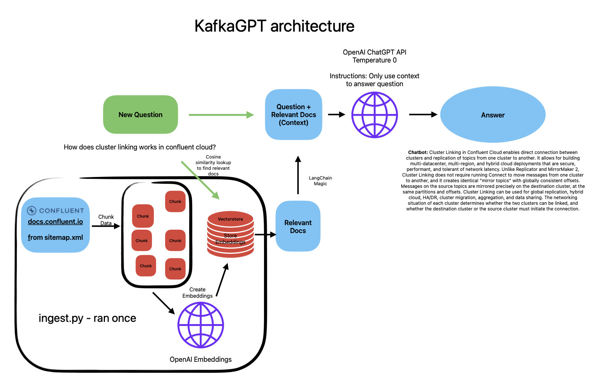

# KafkaGPT

**What if you could ask a question and get an answer from the Confluent documentation?**

This repo is an implementation of a locally hosted chatbot specifically focused on question answering over the [Confluent documentation](https://docs.confluent.io/).
Built with [OpenAI ChatGPT API](https://openai.com/blog/introducing-chatgpt-and-whisper-apis), [LangChain](https://github.com/hwchase17/langchain/) and [FastAPI](https://fastapi.tiangolo.com/).

The app leverages LangChain's streaming support and async API to update the page in real time for multiple users.

---

## ✅ Running locally (MacOS/Linux)

**Note: this app requires OpenAI's ChatGPT API. It costs money to use the API.** More information here: [OpenAI ChatGPT](https://openai.com/pricing)

1. Clone the repo:
   1. `git clone git@github.com:mvfolino68/KafkaGPT.git`
2. Install dependencies:
   1. from within the repo, setup a virtual environment: `python3 -m venv _venv`
   2. activate the virtual environment: `source _venv/bin/activate`
   3. install dependencies: `pip install -r requirements.txt`
3. Set up an OpenAI API Key:
   1. you can use the [OpenAI API](https://openai.com/docs/developer-quickstart/api-key) documentation to set up an API key.
   2. export the API key as an environment variable: `export OPENAI_API_KEY=<your_api_key>`
4. Setup a vectorstore:
   1. option 1: Use the existing vectorstore:
      1. download the vectorstore from here and place it in the root directory of the repo. [download here](https://drive.google.com/uc?export=download&id=1HPa7FX282_1Lzbkhupoh8BibtN2xXEZ5)
   2. option 2: Create a new vectorstore:
      1. Note: this method will take a while to run due to the size of the Confluent docs.
      2. run `python ingest.py` to ingest Confluent docs data into the vectorstore (only needs to be done once).
      3. you can use other [Document Loaders](https://langchain.readthedocs.io/en/latest/modules/document_loaders.html) to load your own data into the vectorstore.
5. Run the app: `make start`
6. Open [localhost:9000](http://localhost:9000) in your browser.
7. Ask a question! 🎉

## 📸 Screenshots

---

## 🤔 How it works

### 📝 Ingestion (run once to create the vectorstore)

1. Pull html from the [Confluent documentation](https://docs.confluent.io/) using `sitemap.xml` and BeautifulSoup to clean the html.
2. Load the data into DocumentStore using LangChain's [UstructuredHTML Loader](https://langchain.readthedocs.io/en/latest/modules/document_loaders/examples/html.html).
3. Chunk the documents into smaller chunks using LangChain's [TextSplitter](https://langchain.readthedocs.io/en/latest/reference/modules/text_splitter.html).
4. Create embeddings for each chunk using OpenAI's [ChatGPT API](https://openai.com/blog/introducing-chatgpt-and-whisper-apis).
5. Load the embeddings into a vectorstore using LangChain's [vectorstore wrapper](https://langchain.readthedocs.io/en/latest/reference/modules/vectorstore.html).
   1. FAISS is used as the vectorstore in this example. More information on FAISS can be found [here](https://ai.facebook.com/tools/faiss/).

### 📝 Question-Answering

1. User accesses text input box and chat history via the web app.
2. The web app sends the chat history and user input to the backend. The backend uses LangChain's [ChatVectorDBChain](https://langchain.readthedocs.io/en/latest/modules/indexes/chain_examples/chat_vector_db.html) to:
   1. Determine what a standalone question would be (using ChatGPT).
   2. Look up relevant documents from the vectorstore.
   3. Pass the standalone question and relevant documents to ChatGPT to generate a final answer.
3. Return the final answer to the web app and add the answer to the chat history.

Diagram:

## 📚 Technical description

There are two components: ingestion and question-answering.

Ingestion has the following steps:

1. Pull html from documentation site
2. Load html with LangChain's [UstructuredHTML Loader](https://langchain.readthedocs.io/en/latest/modules/document_loaders/examples/html.html)
3. Split documents with LangChain's [TextSplitter](https://langchain.readthedocs.io/en/latest/reference/modules/text_splitter.html)
4. Create a vectorstore of embeddings, using LangChain's [vectorstore wrapper](https://langchain.readthedocs.io/en/latest/reference/modules/vectorstore.html) (with OpenAI's embeddings and FAISS vectorstore).

Question-Answering has the following steps, all handled by [ChatVectorDBChain](https://langchain.readthedocs.io/en/latest/modules/indexes/chain_examples/chat_vector_db.html):

1. Given the chat history and new user input, determine what a standalone question would be (using ChatGPT).
2. Given that standalone question, look up relevant documents from the vectorstore.
3. Pass the standalone question and relevant documents to ChatGPT to generate a final answer.

## 🚀 Important Links

Blog Posts:

- [Initial Launch](https://blog.langchain.dev/langchain-chat/)
- [OpenAI ChatGPT](https://blog.langchain.dev/openai-chatgpt/)
- [Video Explaination](https://www.youtube.com/watch?v=prbloUGlvLE)

## Contributing to KafkaGPT

I'm happy to accept contributions to this project. Please open an issue or a pull request.

## Future Work

- Make the app available online (currently only available locally). This will require a hosting service that can support the vectorstore and the web app.
- Allow users to input their own OpenAI API key in the frontend.
- Include more documentation sites.
- Tune the ChatVectorDBChain to improve the quality of the answers.
- Produce the chat history as a Kafka topic.
