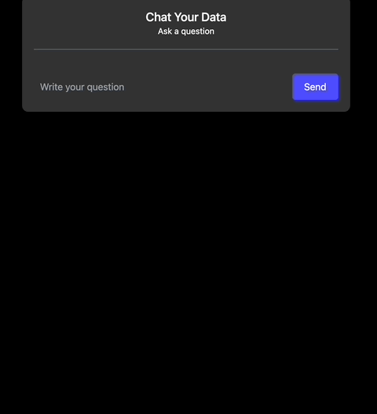

# KafkaGPT

This repo is an implementation of a locally hosted chatbot specifically focused on question answering over the [Confluent documentation](https://docs.confluent.io/).
Built with [LangChain](https://github.com/hwchase17/langchain/) and [FastAPI](https://fastapi.tiangolo.com/).

The app leverages LangChain's streaming support and async API to update the page in real time for multiple users.

## ✅ Running locally

1. Install dependencies: `pip install -r requirements.txt`
2. Set up an OpenAI API API Key and save it as an environment variable `OPENAI_API_KEY` as follows:
   1. Export the API key as an environment variable: `export OPENAI_API_KEY=<your_api_key>`
   2. You can use the [OpenAI API](https://openai.com/docs/developer-quickstart/api-key)
3. Run `ingest.py` to ingest Confluent docs data into the vectorstore (only needs to be done once).
   1. You can use other [Document Loaders](https://langchain.readthedocs.io/en/latest/modules/document_loaders.html) to load your own data into the vectorstore.
4. Run the app: `make start`
   1. To enable tracing, make sure `langchain-server` is running locally and pass `tracing=True` to `get_chain` in `main.py`. You can find more documentation [here](https://langchain.readthedocs.io/en/latest/tracing.html).
5. Open [localhost:9000](http://localhost:9000) in your browser.

## 📸 Screenshots

## 🚀 Important Links

Blog Posts:

- [Initial Launch](https://blog.langchain.dev/langchain-chat/)
- [Streaming Support](https://blog.langchain.dev/streaming-support-in-langchain/)

## 📚 Technical description

There are two components: ingestion and question-answering.

Ingestion has the following steps:

1. Pull html from documentation site
2. Load html with LangChain's [UstructuredHTML Loader](https://langchain.readthedocs.io/en/latest/modules/document_loaders/examples/html.html)
3. Split documents with LangChain's [TextSplitter](https://langchain.readthedocs.io/en/latest/reference/modules/text_splitter.html)
4. Create a vectorstore of embeddings, using LangChain's [vectorstore wrapper](https://langchain.readthedocs.io/en/latest/reference/modules/vectorstore.html) (with OpenAI's embeddings and FAISS vectorstore).

Question-Answering has the following steps, all handled by [ChatVectorDBChain](https://langchain.readthedocs.io/en/latest/modules/indexes/chain_examples/chat_vector_db.html):

1. Given the chat history and new user input, determine what a standalone question would be (using ChatGPT).
2. Given that standalone question, look up relevant documents from the vectorstore.
3. Pass the standalone question and relevant documents to ChatGPT to generate a final answer.
